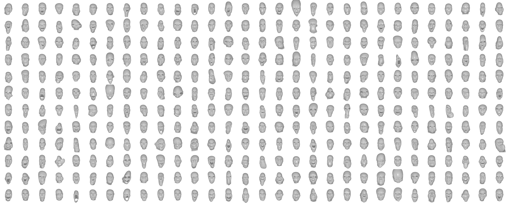

# 3D-CariGAN: An End-to-End Solution to 3D Caricature Generation from Normal Face Photos

This repository contains the source code and dataset for the paper 3D-CariGAN: An End-to-End Solution to 3D Caricature Generation from Normal Face Photos by [Zipeng Ye](https://qq775193759.github.io/), Mengfei Xia, Yanan Sun, Ran Yi, Minjing Yu, [Juyong Zhang](http://staff.ustc.edu.cn/~juyong/), [Yu-Kun Lai](http://users.cs.cf.ac.uk/Yukun.Lai/) and [Yong-Jin Liu](https://cg.cs.tsinghua.edu.cn/people/~Yongjin/Yongjin.htm), which is accepted by IEEE Transactions on Visualization and Computer Graphics (TVCG).
 
This repository contains two parts: dataset and source code.

## 2D and 3D Caricature Dataset

### 2D Caricature Dataset


We collect 5,343 hand-drawn portrait caricature images from Pinterest.com and WebCaricature dataset with facial landmarks extracted by a landmark detector, followed by human interaction for correction if needed. 

The 2D dataset is in ```cari_2D_dataset.zip``` file.

### 3D Caricature Dataset



We use [the method](https://openaccess.thecvf.com/content_cvpr_2018/papers/Wu_Alive_Caricature_From_CVPR_2018_paper.pdf) to generate 5,343 3D caricature meshes of the same topology. We align the pose of the generated 3D caricature meshes with the pose of a template 3D head using an ICP method, where we use 5 key landmarks in eyes, nose and mouth as the landmarks for ICP. We normalize the coordinates of the 3D caricature mesh vertices by translating the center of meshes to the origin and scaling them to the same size.

The 3D dataset is in ```cari_3D_dataset.zip``` file.

### 3DCariPCA

We use the 3D caricature dataset to build a PCA model. We use ```sklearn.decomposition.PCA``` to build 3DCariPCA. The PCA model is ```pca200_icp.model``` file. You could use ```joblib``` to load the model and use it.

### Download

You can download the two datasets and PCA in [google drive](https://drive.google.com/drive/folders/13lYYHOIQN_jJG5d-mBglD0BjWY1lqOWy?usp=sharing) and [BaiduYun](https://pan.baidu.com/s/1rtFtOeixNS1CACaZagrNLw) (code: 3kz8).

## Source Code

### Running Environment

Ubuntu 16.04 + Python3.7

You can install the environment directly by using ```conda env create -f env.yml``` in conda.

### Training

We use our 3D caricature dataset and [CelebA-Mask-HQ dataset](https://github.com/lee7282007/CelebAMask-HQ) to train 3D-CariGAN. You could download CelebA-Mask-HQ dataset and then reconstruct their 3D normal heads of all images. The 3D normal heads are for calculating loss.

### Inferring

The inferring code is ```cari_pipeline.py``` file in ```pipeline``` folder. You could train your model or use our pre-trained model.

The pipeline includes two optional sub-program ```eye_complete``` and ```color_complete```, which are implemented by C++. You should compile them and then use them. The ```eye_complete``` is for completing the eye part of mesh and the ```color_complete``` is for texture completion.

### Pre-trained Model

You can download pre-trained model ```latest.pth``` in [google drive](https://drive.google.com/drive/folders/13lYYHOIQN_jJG5d-mBglD0BjWY1lqOWy?usp=sharing) and [BaiduYun](https://pan.baidu.com/s/1rtFtOeixNS1CACaZagrNLw) (code: 3kz8). You should put it into ```./checkpoints```.


## Additional notes

Please cite the following paper if the dataset and code help your research:

Citation:

```
@article{ye2021caricature,
 author = {Ye, Zipeng and Xia, Mengfei and Sun, Yanan and Yi, Ran and Yu, Minjing and Zhang, Juyong and Lai, Yu-Kun and Liu, Yong-Jin},
 title = {3D-CariGAN: An End-to-End Solution to 3D Caricature Generation from Normal Face Photos},
 journal = {IEEE Transactions on Visualization and Computer Graphics},
 year = {2021},
}
```

The paper will be published.
